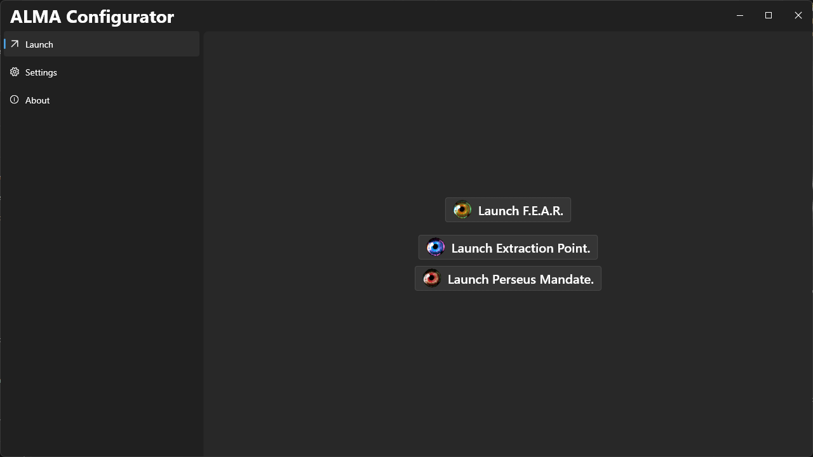
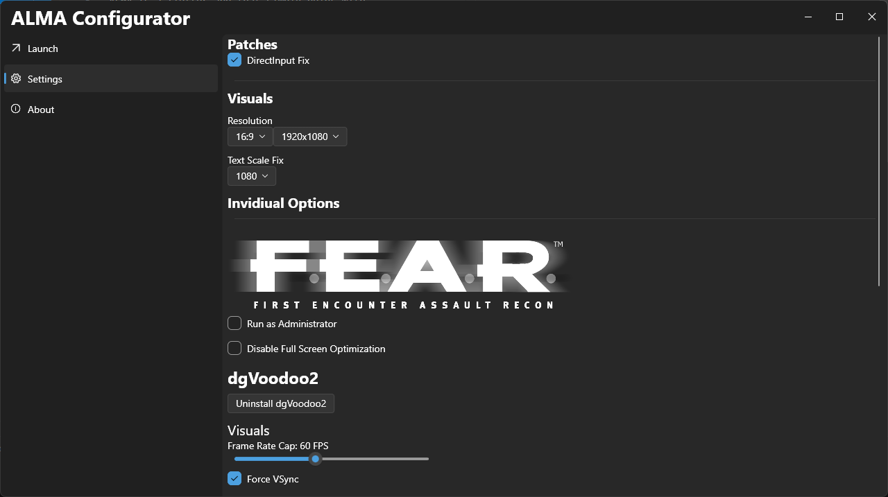

# ALMA Configurator

## What is ALMA?

ALMA is a flutter app that simply helps with configuring and patching the original F.E.A.R. game and it's expansions with fixes from [PCGamingWiki](https://www.pcgamingwiki.com/wiki/F.E.A.R.). It's not complex, however it does improve stability and performance drastically without too much effort.

> [!Important]
> The launch page only works with the steam version.

## Images:

## Why create ALMA?

The goal of ALMA is just to make playing F.E.A.R simple, without needing to download patches from all over the place. Its not only designed to make it easier to recommend F.E.A.R to friends and family, but also for myself. I can debug and tweak each game to work manually, however I sometimes just want to reinstall F.E.A.R and start playing.

## Future Plans for ALMA

1. Add key rebinding to ALMA, so the same key binds are shared between all three games.
2. Have a graphics section in settings.
3. Maybe have a mod manager (not promising anything.)
